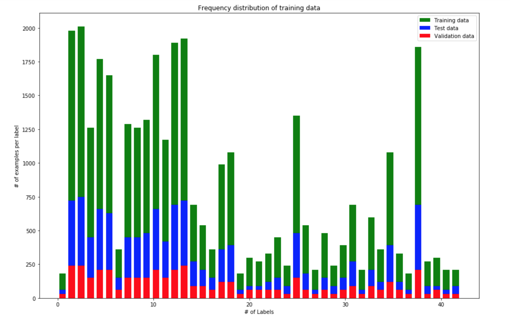
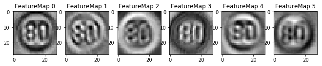

# **Traffic Sign Recognition** 

## Project Writeup 

---

## **Build a Traffic Sign Recognition Project**

The goals / steps of this project are the following:
* Load the data set
* Explore, summarize and visualize the data set
* Design, train and test a model architecture
* Use the model to make predictions on new images
* Analyze the softmax probabilities of the new images
* Summarize the results with a written report

[//]: # (Image References)
[image4]: ./traffic_signs/1.jpg "Traffic Sign 1"
[image5]: ./traffic_signs/3.jpg "Traffic Sign 2"
[image6]: ./traffic_signs/5.jpg "Traffic Sign 3"
[image7]: ./traffic_signs/11.jpg "Traffic Sign 4"
[image8]: ./traffic_signs/13.jpg "Traffic Sign 5"
[image9]: ./traffic_signs/14.jpg "Traffic Sign 6"
[image10]: ./traffic_signs/27.jpg "Traffic Sign 7"

## Rubric Points
### Here I will consider the [rubric points](https://review.udacity.com/#!/rubrics/481/view) individually and describe how I addressed each point in my implementation.  

---
### Writeup / README

#### 1. Provide a Writeup / README that includes all the rubric points and how you addressed each one. You can submit your writeup as markdown or pdf. You can use this template as a guide for writing the report. The submission includes the project code.

Link to my [project code](https://github.com/udacity/CarND-Traffic-Sign-Classifier-Project/blob/master/Traffic_Sign_Classifier.ipynb)

### **Data Set Summary & Exploration**

#### 1. Provide a basic summary of the data set. In the code, the analysis should be done using python, numpy and/or pandas methods rather than hardcoding results manually.

I used the pandas library to calculate summary statistics of the traffic
signs data set:

* The size of training set is 34799
* The size of the validation set is 4410
* The size of test set is 12630
* The shape of a traffic sign image is 32 x 32 x 3 (width x height x channels)
* The number of unique classes/labels in the data set is 43

The pickled data is a dictionary with 4 key/value pairs:

*'features'* is a 4D array containing raw pixel data of the traffic sign images, (num examples, width, height, channels).

*'labels'* is a 1D array containing the label/class id of the traffic sign. The file signnames.csv contains id -> name mappings for each id.

*'sizes'* is a list containing tuples, (width, height) representing the original width and height the image.

*'coords'* is a list containing tuples, (x1, y1, x2, y2) representing coordinates of a bounding box around the sign in the image.

#### 2. Include an exploratory visualization of the dataset.

<figure>
 
 <figcaption>
 

 
 </figcaption>
</figure>

Here is an exploratory visualization of the data set. It is a bar chart showing the distribution of training, validation and test data for each of the 43 traffic signs. We can clearly see that the data distribution is not symmetric. If this poses a problem in training the network then data augmentation techniques like translation, rotation, random cropping, etc. can be employed. 

<figure>
 
 <figcaption>
 

 
 </figcaption>
</figure>

### **Design and Test a Model Architecture**

#### 1. Describe how you preprocessed the image data. What techniques were chosen and why did you choose these techniques? Consider including images showing the output of each preprocessing technique. Pre-processing refers to techniques such as converting to grayscale, normalization, etc. (OPTIONAL: As described in the "Stand Out Suggestions" part of the rubric, if you generated additional data for training, describe why you decided to generate additional data, how you generated the data, and provide example images of the additional data. Then describe the characteristics of the augmented training set like number of images in the set, number of images for each class, etc.)

**Following preprocessing techniques have been used on the data:**

1. Shuffling
2. Local Histogram Equalization
3. Normalization

Here's a sample of image before preprocessing.
<figure>
 
 <figcaption>
 

 
 </figcaption>
</figure>

1. **Shuffling**: As a first step, I decided to randomize the training data in order to ensure that the batched training input data contains samples from multiple sign-types. This helps to generalize the neural network.

2. **Local Histogram Equalization**: Histogram equalization distributes the pixel values throughout a range, thus equalizing and making the pixel distribuiton normal shaped. The idea behind using this technique is to boost the lower contrast of the darker regions and reduce from the higher/brighter regions of the image. This is especially useful in our case as we are dealing with real world outdoor images.

3. **Normalization**: As a last step, we normalize the image data to speed up the learning process. Normalization helps because by bringing the features i.e. the range of pixel intensities on a similar scale, we can ensure that the cost function will be more round. This helps us in avoiding getting struck in local minimas and ensuress faster optimization.

Here's a sample of images after all the preprocessing.
<figure>
 
 <figcaption>
 

 
 </figcaption>
</figure>

#### 2. Describe what your final model architecture looks like including model type, layers, layer sizes, connectivity, etc.) Consider including a diagram and/or table describing the final model.

The final model architecture is inspired from LeNet. I had initially used LeNet model but it could only give a train/test accuracy of around 94/91%. I also tweaked some of the hyperparameters like changing the activation function to "Elu", modifying the stride and padding values, increasing the number of epochs, etc. but the train/test accuracy was still around the same range. Finally, I decided to add an additional Conv layer along with higher number of filters/channels for the Conv layers and was able to achieve a train/test accuracy of around 99.1/94.1%.

**Modified LeNet Model**

Input -> Convolution -> ReLU -> Pooling -> Convolution -> ReLU -> Pooling -> Convolution -> ReLU -> Pooling -> FullyConnected -> ReLU -> FullyConnected

Here's the visualization of the original LeNet model.
<figure>
 
 <figcaption>
 

 
 </figcaption>
</figure>

**Input**
The LeNet architecture accepts a 32x32xC image as input, where C is the number of color channels, 3 in our case. 

**Architecture**

**Layer 1: (Convolutional)** The output shape is 28x28x6.

**Activation:** Your choice of activation function(Relu).

**Pooling:** The output shape is 27x27x6.

**Layer 2: (Convolutional)** The output shape is 23x23x16.

**Activation:** Your choice of activation function(Relu).

**Pooling:** The output shape is 11x11x16.

**Layer 3: (Convolutional)** The output shape is 7x7x24.

**Activation:** Your choice of activation function(Relu).

**Pooling:** The output shape is 5x5x24.

**Flatten:** Flatten the output shape of the final pooling layer such that it's 1D instead of 3D.

**Layer 4: (Fully Connected)** This should have 120 outputs.

**Activation:** Your choice of activation function(Relu).

**Layer 5: (Fully Connected)** This should have 84 outputs.

**Activation:** Your choice of activation function(Relu).

**Layer 6: (Fully Connected) (Logits):** This should have 43 outputs.

#### 3. Describe how you trained your model. The discussion can include the type of optimizer, the batch size, number of epochs and any hyperparameters such as learning rate.

For training the model I used the same optimizer and structure as mentioned in the LeNet paper and class assignement.

Following is the summary of the network's hyperparameters:

Optimizer -> AdamOptimizer

Learning rate for Adam -> 0.001 

Batch size -> 128

Epochs -> 20

#### 4. Describe the approach taken for finding a solution and getting the validation set accuracy to be at least 0.93. Include in the discussion the results on the training, validation and test sets and where in the code these were calculated. Your approach may have been an iterative process, in which case, outline the steps you took to get to the final solution and why you chose those steps. Perhaps your solution involved an already well known implementation or architecture. In this case, discuss why you think the architecture is suitable for the current problem.

My final model results were:

***Training set accuracy of 99.1%***

***Validation set accuracy of ~95-96%*** 

***Test set accuracy of 94.1%***

As mentioned earlier, I implemented my ConvNet as described in the [paper](http://yann.lecun.com/exdb/lenet/), but modified it slightly for our problem statement. 

ConvNet's were chosen as they have proven to be the state of art for image classification tasks (among many others). This was verified with the high training and testing accuracy of the model.

Some of the important reasons behind choosing ConvNet's are the following:
1. Require very less number of trainable parameters as compared to Fully connected networks.
2. Support sharing of weights and partially connected layers to maintain generality. 
3. Support automatic feature extraction and translation invariances that makes them resistant to noise.

### **Test a Model on New Images**

#### 1. Choose five German traffic signs found on the web and provide them in the report. For each image, discuss what quality or qualities might be difficult to classify.

Here are five German traffic signs that I found on the web:

<figure>
 
 <figcaption>
 

 
 </figcaption>
</figure>
<figure>
 
 <figcaption>
 

 
 </figcaption>
</figure>
<figure>
 
 <figcaption>
 

 
 </figcaption>
</figure>
<figure>
 
 <figcaption>
 

 
 </figcaption>
</figure>
<figure>
 
 <figcaption>
 

 
 </figcaption>
</figure>
<figure>
 
 <figcaption>
 

 
 </figcaption>
</figure>
<figure>
 
 <figcaption>
 

 
 </figcaption>
</figure>

The network may face some difficulties in differentiating between the "30", "60" and "80" km/hr speed limit signs. Also, the pedestrian and yield traffic sign look quite simialr to each other.

#### 2. Discuss the model's predictions on these new traffic signs and compare the results to predicting on the test set. At a minimum, discuss what the predictions were, the accuracy on these new predictions, and compare the accuracy to the accuracy on the test set (OPTIONAL: Discuss the results in more detail as described in the "Stand Out Suggestions" part of the rubric).

Here are the results of the prediction:

| Image			                     |     Prediction	        					| 
|:---------------------:             |:--------------------------------------------:| 
| Stop Sign      		             | Stop sign   									| 
| Pedestrian   			             | Pedestrian                        			|
| Yield					             | Yield										|
| 30 km/h	      		             | 30 km/hr 					 				|
| 60 km/h	      		             | 50 km/hr 					 				|
| 80 km/h	      		             | 80 km/hr 					 				|
| Right-of-way at next intersection  | Right-of-way at next intersection     		|

The model was able to correctly guess 6 of the 7 traffic signs, which gives an accuracy of 85.1%. This is low compared to the accuracy on the test set of 94.1%

#### 3. Describe how certain the model is when predicting on each of the five new images by looking at the softmax probabilities for each prediction. Provide the top 5 softmax probabilities for each image along with the sign type of each probability. (OPTIONAL: as described in the "Stand Out Suggestions" part of the rubric, visualizations can also be provided such as bar charts)

The top five soft max probabilities for the web images along with the predicted class names is presented below.

<figure>
 
 <figcaption>
 

 
 </figcaption>
</figure>

<figure>
 
 <figcaption>
 

 
 </figcaption>
</figure>

<figure>
 
 <figcaption>
 

 
 </figcaption>
</figure>

<figure>
 
 <figcaption>
 

 
 </figcaption>
</figure>

<figure>
 
 <figcaption>
 

 
 </figcaption>
</figure>

<figure>
 
 <figcaption>
 

 
 </figcaption>
</figure>

<figure>
 
 <figcaption>
 

 
 </figcaption>
</figure>

As we can observe from the visulazation, the model gave incorrect prediction on one out the seven images. Upon taking a closer look at the predictions, we can observe that 
1. Model probably had problems in differentiating between "5" and "6" for the speed limit traffic sign but atleast it was able to detect it as a speed limit sign(~0.98 for top 2 classes).
2. Rest of the images have been correctly classified with high confidence apart from the "30km/hr" speed limit sign. Here again the model got slightly confused between "8" and "3".

### (Optional) Visualizing the Neural Network (See Step 4 of the Ipython notebook for more details)
####1. Discuss the visual output of your trained network's feature maps. What characteristics did the neural network use to make classifications?

Below are the activation feature maps for the first convolutional layer. It seems like the neural network uses gradients for edge detection in order to make the classifications.

<figure>
 
 <figcaption>
 

 
 </figcaption>
</figure>
<figure>
 
 <figcaption>
 

 
 </figcaption>
</figure>
<figure>
 
 <figcaption>
 

 
 </figcaption>
</figure>
<figure>
 
 <figcaption>
 

 
 </figcaption>
</figure>
<figure>
 
 <figcaption>
 

 
 </figcaption>
</figure>
<figure>
 
 <figcaption>
 

 
 </figcaption>
</figure>
<figure>
 
 <figcaption>
 

 
 </figcaption>
</figure>